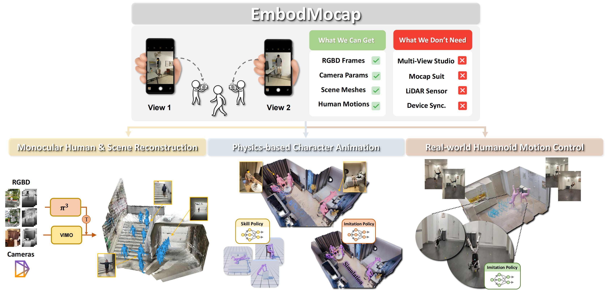

<h1 align="center">[CVPR 2026] EmbodMocap: In-the-Wild 4D Human-Scene Reconstruction for Embodied Agents</h1>

<div align="center">
    <p>
        <a href="https://wenjiawang0312.github.io/">Wenjia Wang</a><sup>1,*</sup>  
        <a href="https://liangpan99.github.io/">Liang Pan</a><sup>1,*</sup>  
        <a href="https://phj128.github.io/">Huaijin Pi</a><sup>1</sup>  
        <a href="https://thorin666.github.io/">Yuke Lou</a><sup>1</sup>  
        <a href="https://xuqianren.github.io/">Xuqian Ren</a><sup>2</sup>  
        <a href="https://littlecobber.github.io/">Yifan Wu</a><sup>1</sup>  
        <br>
        <a href="https://zycliao.com/">Zhouyingcheng Liao</a><sup>1</sup>  
        <a href="http://yanglei.me/">Lei Yang</a><sup>3</sup>  
        <a href="https://rishabhdabral.github.io/">Rishabh Dabral</a><sup>4</sup>
        <a href="https://people.mpi-inf.mpg.de/~theobalt/">Christian Theobalt</a><sup>4</sup>
        <a href="https://i.cs.hku.hk/~taku/">Taku Komura</a><sup>1</sup>
    </p>
    <p>
        (*: Core Contributor)
    </p>
    <p>
        <sup>1</sup>The University of Hong Kong    
        <sup>2</sup>Tampere University
        <br>
        <sup>3</sup>The Chinese University of Hong Kong    
        <sup>4</sup>Max-Planck Institute for Informatics
    </p>

</div>

<p align="center">
    <a href="https://arxiv.org/abs/2602.23205" target="_blank">
    
    </a>
    <a href="https://wenjiawang0312.github.io/projects/embodmocap/" target="_blank">
    
    </a>
</p>

<div align="center">
    <a href="https://www.youtube.com/watch?v=B5CDThL2ypo" target="_blank">
        
    </a>
</div>

# 🗓️ News:

🎆 2026.Feb.22, EmbodMocap has been accepted to CVPR2026, codes and data will be released soon.

# 🚀 Quick Start

For new users, follow this order:

1. **Installation**

   - English: [docs/install.md](docs/install.md)
   - 中文: [docs/install_zh.md](docs/install_zh.md)
   - Troubleshooting: [docs/QAs.md](docs/QAs.md)
2. **Run the Main Pipeline**

   - English: [docs/embod_mocap.md](docs/embod_mocap.md)
   - 中文: [docs/embod_mocap_zh.md](docs/embod_mocap_zh.md)
3. **Understand Stages and Config Differences**

   - Stage details: [English](docs/step_details.md) | [中文](docs/step_details_zh.md)
4. **Visualization**

   - English: [docs/visualization.md](docs/visualization.md)
   - 中文: [docs/visualization_zh.md](docs/visualization_zh.md)

Notes:

- Compared to the paper version, the open-source release replaces **PromptDA** with **LingbotDepth**.
- `fast` is mainly for users who only care about **mesh + motion** for embodied tasks.
- `standard` is for users who also need **RGBD/mask** assets for training reconstruction models.

# 🎓 Citation

If you find this project useful in your research, please consider citing us:

```
@inproceedings{wang2025embodmocap,
title = {EmbodMocap: In-the-Wild 4D Human-Scene Reconstruction for Embodied Agents.},
booktitle = {CVPR},
author = {Wang, Wenjia and Pan, Liang and Pi, Huaijin and Lou, Yuke and Ren, Xuqian and Wu, Yifan and Liao, Zhouyingcheng and Yang, Lei, Dabral, Rishabh and Theobalt, Christian and Komura, Taku},
year = {2026}
}
```

# 😁 Related Repos

We acknowledge [VGGT](https://github.com/facebookresearch/vggt), [TRAM](https://github.com/yufu-wang/tram), [ViTPose](https://github.com/ViTAE-Transformer/ViTPose), [Lang-Segment-Anything](https://github.com/luca-medeiros/lang-segment-anything), [PromptDA](https://github.com/DepthAnything/PromptDA), [Lingbot-Depth](https://github.com/Robbyant/lingbot-depth), [SAM](https://github.com/facebookresearch/segment-anything), [COLMAP](https://github.com/colmap/colmap) for their awesome codes.

# 📧 Contact

Feel free to contact me for other questions or cooperation: wwj2022@connect.hku.hk
